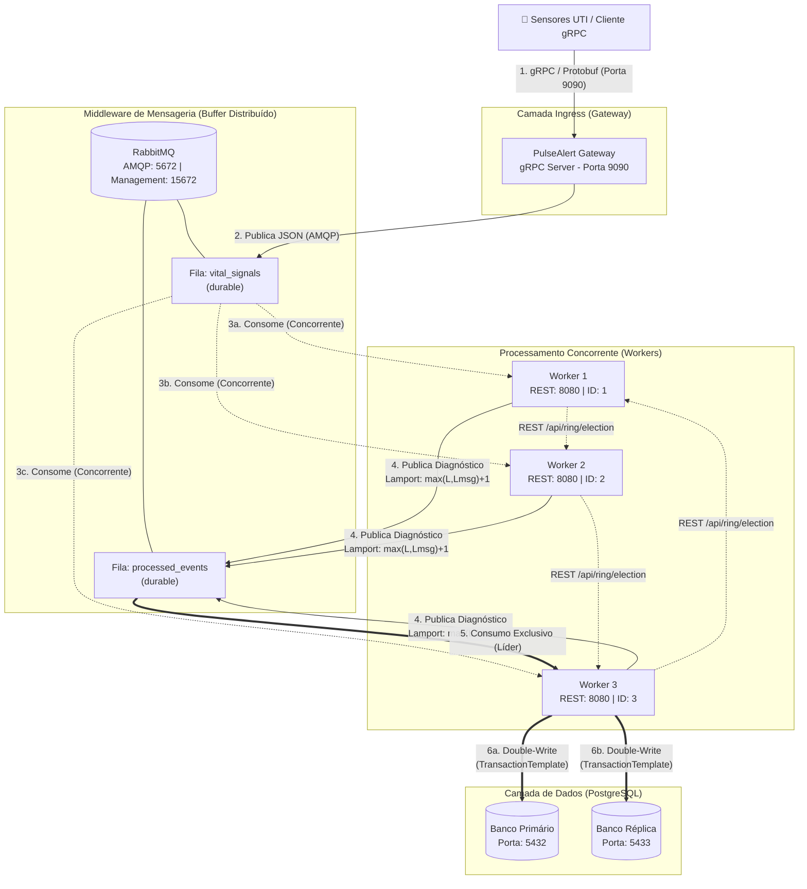

# PulseAlert — Sistema Distribuído de Monitoramento de UTI

## 👥 Integrantes

| Nome Completo | Matrícula |
|---|---|
| Enock De Oliveira Memelli Junior | 6-2211755 |
| Felipe Sabino | <!-- PREENCHER --> |
| Samuel Mota | <!-- PREENCHER --> |
| Pedro Muchelin | <!-- PREENCHER --> |

---

## 🏥 Tema e Domínio de Negócio

O **PulseAlert** é um sistema distribuído voltado para a área da **Saúde**. Seu objetivo é realizar a ingestão, o monitoramento e o processamento em tempo real de sinais vitais de pacientes internados em **Unidades de Terapia Intensiva (UTIs)**.

O sistema simula sensores de leito que enviam dados contínuos de telemetria (frequência cardíaca, pressão arterial, saturação de oxigênio e temperatura) via comunicação síncrona de baixa latência (**gRPC com Protocol Buffers**). Esses dados são repassados a um buffer distribuído (**RabbitMQ / AMQP**) para garantir desacoplamento entre a camada de ingresso e os consumidores.

Um cluster de 3 nós trabalhadores (**Workers**) consome os dados de forma concorrente sob o padrão **Competing Consumers**, aplicando regras de diagnóstico clínico — detecção de **arritmia severa** e **choque hipovolêmico**. Cada worker mantém um **Relógio Lógico de Lamport** para ordenação causal dos eventos processados.

A persistência é feita utilizando o padrão **Double-Write** em um banco de dados **Primário** e uma **Réplica** (ambos **PostgreSQL**), orquestrada exclusivamente por um **Worker Líder** eleito dinamicamente via **Algoritmo em Anel (Ring Election)**.

### Decisões de Arquitetura e Trade-offs

| Decisão | Escolha | Justificativa |
|---|---|---|
| Protocolo de entrada | **gRPC** (vs. Sockets TCP puros) | Serialização binária eficiente via Protobuf, contrato de API fortemente tipado (`.proto`), geração automática de stubs e suporte nativo a streaming. |
| Middleware de mensageria | **RabbitMQ** (vs. Kafka) | Modelo de filas com ACK/NACK individual, ideal para Competing Consumers com entrega garantida por mensagem. Kafka seria mais adequado para event sourcing com log imutável, mas adiciona complexidade desnecessária para este caso de uso. |
| Relógio lógico | **Lamport** (vs. Vetorial) | Suficiente para ordenação causal total num cenário onde os workers não se comunicam diretamente entre si (comunicação é mediada pela fila). Relógios Vetoriais seriam necessários se precisássemos distinguir concorrência entre pares de eventos. |
| Algoritmo de eleição | **Anel (Ring)** (vs. Bully) | Gera menos tráfego de rede (O(n) mensagens vs. O(n²) no Bully). A topologia em anel é natural para um número fixo e pequeno de workers. |
| Persistência | **Double-Write** (Primário + Réplica) | Garante redundância imediata sem depender de replicação assíncrona do PostgreSQL, com consistência transacional em cada banco via `TransactionTemplate`. |

---

## 🏗️ Arquitetura e Fluxo de Mensagens

O diagrama abaixo detalha os componentes, as portas expostas e o fluxo de dados completo do sistema.



### Tabela de Portas e Protocolos

| Componente | Porta Interna | Porta Externa (Host) | Protocolo | Descrição |
|---|---|---|---|---|
| **Gateway** | 9090 | 9090 | gRPC / HTTP/2 | Ponto de entrada — recebe sinais vitais via Protobuf |
| **RabbitMQ** | 5672 | 5672 | AMQP | Protocolo de mensageria (filas) |
| **RabbitMQ Management** | 15672 | 15672 | HTTP | Painel administrativo web |
| **Worker 1** | 8080 | — | HTTP/REST | Eleição em anel + heartbeat |
| **Worker 2** | 8080 | — | HTTP/REST | Eleição em anel + heartbeat |
| **Worker 3** | 8080 | — | HTTP/REST | Eleição em anel + heartbeat |
| **PostgreSQL Primário** | 5432 | 5432 | TCP/PostgreSQL | Banco de dados principal |
| **PostgreSQL Réplica** | 5432 | 5433 | TCP/PostgreSQL | Banco de dados réplica |

---

## 🚀 Guia de Execução Local (Passo a Passo)

### Pré-requisitos

| Ferramenta | Versão Mínima | Finalidade |
|---|---|---|
| **Java JDK** | 17+ | Compilação e execução do projeto |
| **Apache Maven** | 3.8+ | Build do projeto (ou use o `./mvnw` incluso) |
| **Docker** | 24+ | Contêineres dos serviços |
| **Docker Compose** | 2.0+ | Orquestração dos contêineres |
| **Cliente gRPC** | — | Testes (Postman, grpcurl, BloomRPC ou Evans) |

### Passo 1 — Clonar o Repositório

```bash
git clone https://github.com/<seu-usuario>/programacao-distribuida.git
cd programacao-distribuida
```

### Passo 2 — Compilar o Projeto com Maven

O build deve ser executado na raiz do projeto pai. Isso compila os 3 módulos na ordem correta (`proto` → `gateway` → `worker`):

```bash
# Linux / macOS
./mvnw clean package -DskipTests

# Windows
mvnw.cmd clean package -DskipTests
```

> **Nota:** O módulo `pulsealert-proto` gera automaticamente os stubs gRPC a partir do arquivo `.proto` via `protobuf-maven-plugin`.

### Passo 3 — Subir Toda a Infraestrutura com Docker Compose

```bash
docker-compose up --build -d
```

Isso inicia os seguintes contêineres:

| Contêiner | Imagem | Função |
|---|---|---|
| `pulse_rabbitmq` | `rabbitmq:3-management-alpine` | Broker de mensagens |
| `pulse_db_primary` | `postgres:15-alpine` | Banco primário |
| `pulse_db_replica` | `postgres:15-alpine` | Banco réplica |
| `pulse_gateway` | Build local | Servidor gRPC (Ingress) |
| `pulse_worker1` | Build local | Worker consumidor (ID=1) |
| `pulse_worker2` | Build local | Worker consumidor (ID=2) |
| `pulse_worker3` | Build local | Worker consumidor (ID=3) |

### Passo 4 — Verificar se Todos os Serviços Subiram

```bash
docker-compose ps
```

Aguarde até que todos os contêineres estejam com status `Up`. O RabbitMQ pode levar ~15 segundos para ficar pronto.

Acesse o painel do RabbitMQ para verificar as filas:
- **URL:** http://localhost:15672
- **Usuário:** `pulse_admin`
- **Senha:** `pulse_secure2026`

### Passo 5 — Enviar Sinais Vitais via gRPC

Use um cliente gRPC (Postman, `grpcurl`, BloomRPC ou Evans) apontando para `localhost:9090`.

**Serviço:** `pulsealert.PulseAlertService`
**Método:** `SendVitalSign`

**Exemplo de payload (caso normal):**
```json
{
  "event_id": "evt-001",
  "correlation_id": "corr-paciente-42",
  "bed_id": "UTI-LEITO-07",
  "heart_rate": 78.0,
  "spo2": 97.5,
  "systolic_pressure": 120.0,
  "diastolic_pressure": 80.0,
  "temperature": 36.8
}
```

**Exemplo de payload (arritmia severa — FC > 140):**
```json
{
  "event_id": "evt-002",
  "correlation_id": "corr-paciente-42",
  "bed_id": "UTI-LEITO-07",
  "heart_rate": 185.0,
  "spo2": 95.0,
  "systolic_pressure": 110.0,
  "diastolic_pressure": 70.0,
  "temperature": 37.2
}
```

**Exemplo de payload (choque hipovolêmico — PA Sistólica < 90 E SpO2 < 90):**
```json
{
  "event_id": "evt-003",
  "correlation_id": "corr-paciente-15",
  "bed_id": "UTI-LEITO-03",
  "heart_rate": 110.0,
  "spo2": 82.0,
  "systolic_pressure": 65.0,
  "diastolic_pressure": 40.0,
  "temperature": 35.1
}
```

**Exemplo com `grpcurl`:**
```bash
grpcurl -plaintext -d '{
  "event_id": "evt-001",
  "correlation_id": "corr-paciente-42",
  "bed_id": "UTI-LEITO-07",
  "heart_rate": 78.0,
  "spo2": 97.5,
  "systolic_pressure": 120.0,
  "diastolic_pressure": 80.0,
  "temperature": 36.8
}' localhost:9090 pulsealert.PulseAlertService/SendVitalSign
```

**Resposta esperada:**
```json
{
  "event_id": "evt-001",
  "status": "RECEIVED",
  "message": "Evento alocado na fila de processamento"
}
```

### Passo 6 — Acompanhar os Logs em Tempo Real

```bash
# Logs de todos os serviços
docker-compose logs -f

# Logs apenas dos workers
docker-compose logs -f worker1 worker2 worker3

# Logs apenas do gateway
docker-compose logs -f gateway
```

### Passo 7 — Simular Queda de um Worker (Teste de Tolerância a Falhas)

```bash
# Derrubar o worker líder (ex: worker3)
docker-compose stop worker3

# Observar nos logs dos demais workers a detecção de falha e nova eleição
docker-compose logs -f worker1 worker2

# Reativar o worker
docker-compose start worker3
```

### Passo 8 — Encerrar o Ambiente

```bash
docker-compose down -v
```

---

## 📋 Evidência dos Logs

### Eleição de Líder (Algoritmo em Anel)

Ao iniciar o cluster, os workers detectam a ausência de um líder e disparam automaticamente o processo de eleição via REST no anel circular (`Worker 1 → 2 → 3 → 1`):

```
pulse_worker1  | [MONITOR] A rede está sem líder. Iniciando votação...
pulse_worker1  | [ELEIÇÃO] Voto repassado para o vizinho no anel: http://worker2:8080/api/ring/election

pulse_worker2  | [ELEIÇÃO] Recebida eleição iniciada por 1, maior ID até agora: 1
pulse_worker2  | [ELEIÇÃO] Voto repassado para o vizinho no anel: http://worker3:8080/api/ring/election

pulse_worker3  | [ELEIÇÃO] Recebida eleição iniciada por 1, maior ID até agora: 2
pulse_worker3  | [ELEIÇÃO] Voto repassado para o vizinho no anel: http://worker1:8080/api/ring/election

pulse_worker1  | [ELEIÇÃO] Recebida eleição iniciada por 1, maior ID até agora: 3
pulse_worker1  | [ELEIÇÃO] O novo Líder é o Worker 3

pulse_worker2  | [ELEIÇÃO] O novo Líder é o Worker 3

pulse_worker3  | [ELEIÇÃO] Eu sou o novo Líder! (Worker 3).
pulse_worker3  | [ELEIÇÃO] Iniciando serviço de gravação.
```

**Leitura:** O Worker 1 inicia a eleição com `highestId=1`. Ao passar pelo Worker 2 (`highestId=max(1,2)=2`) e pelo Worker 3 (`highestId=max(2,3)=3`), a mensagem retorna ao iniciador. Como 3 é o maior ID, o Worker 3 é eleito Líder e ativa seu listener exclusivo na fila `processed_events`.

### Relógios Lógicos de Lamport (Atualização Causal)

A cada mensagem consumida da fila `vital_signals`, o worker aplica a regra de Lamport: $L(e') = \max(L_{local}, L_{msg}) + 1$

```
pulse_worker1  | [WORKER-1] Evento evt-001 recebido. Lamport atualizado para: 1
pulse_worker1  | [WORKER-1] Processando FC: 78.0, SpO2: 97.5, PA Sistólica: 120.0
pulse_worker1  | [WORKER-1] Diagnóstico -> Arritmia: false | Choque: false

pulse_worker2  | [WORKER-2] Evento evt-002 recebido. Lamport atualizado para: 1
pulse_worker2  | [WORKER-2] Processando FC: 185.0, SpO2: 95.0, PA Sistólica: 110.0
pulse_worker2  | [WORKER-2] Diagnóstico -> Arritmia: true | Choque: false

pulse_worker3  | [WORKER-3] Evento evt-003 recebido. Lamport atualizado para: 1
pulse_worker3  | [WORKER-3] Processando FC: 110.0, SpO2: 82.0, PA Sistólica: 65.0
pulse_worker3  | [WORKER-3] Diagnóstico -> Arritmia: false | Choque: true

pulse_worker1  | [WORKER-1] Evento evt-004 recebido. Lamport atualizado para: 2
pulse_worker2  | [WORKER-2] Evento evt-005 recebido. Lamport atualizado para: 2
pulse_worker1  | [WORKER-1] Evento evt-006 recebido. Lamport atualizado para: 3
```

**Leitura:** Cada worker mantém seu próprio contador Lamport. A mensagem chega com `lamportClock=0` (atribuído pelo Gateway). O worker calcula `max(0, 0) + 1 = 1` na primeira mensagem. Na segunda mensagem do mesmo worker, calcula `max(1, 0) + 1 = 2`, e assim sucessivamente, garantindo a ordenação causal.

### Consolidação pelo Líder (Double-Write)

O Worker Líder consome exclusivamente da fila `processed_events` e persiste nos dois bancos:

```
pulse_worker3  | [LÍDER] Consolidando evento evt-001 processado pelo Worker 1
pulse_worker3  | [LÍDER] Consolidando evento evt-002 processado pelo Worker 2
pulse_worker3  | [LÍDER] ALERTA CRÍTICO GERADO E REPLICADO PARA O LEITO: UTI-LEITO-07
pulse_worker3  | [LÍDER] Consolidando evento evt-003 processado pelo Worker 3
pulse_worker3  | [LÍDER] ALERTA CRÍTICO GERADO E REPLICADO PARA O LEITO: UTI-LEITO-03
```

### Tolerância a Falhas (ACK/NACK + Reeleição)

Quando um worker é derrubado, o RabbitMQ detecta o desacoplamento do consumidor e reentrega as mensagens não-confirmadas (NACK com requeue). Se o líder cair, os demais workers detectam a falha via heartbeat e disparam nova eleição:

```
pulse_worker1  | [MONITOR] Falha de comunicação com o Líder 3! Destituindo líder e iniciando nova eleição...
pulse_worker1  | [ELEIÇÃO] Voto repassado para o vizinho no anel: http://worker2:8080/api/ring/election

pulse_worker2  | [ELEIÇÃO] Recebida eleição iniciada por 1, maior ID até agora: 1
pulse_worker2  | [ELEIÇÃO] Eu sou o novo Líder! (Worker 2).
pulse_worker2  | [ELEIÇÃO] Iniciando serviço de gravação.

pulse_worker1  | [ELEIÇÃO] O novo Líder é o Worker 2
```

---

## 🧰 Estrutura do Projeto

```
programacao-distribuida/
├── docker-compose.yml              # Orquestração de todos os serviços
├── pom.xml                         # POM pai (Maven multi-módulo)
│
├── scripts/
│   └── init-db.sql                 # Script DDL do banco (montado no PostgreSQL via docker-compose)
│
├── pulsealert-proto/               # Módulo de contrato gRPC
│   ├── pom.xml                     # Dependências gRPC + plugin protobuf-maven
│   └── src/main/proto/
│       └── pulsealert.proto        # Definição do serviço e mensagens Protobuf
│
├── pulsealert-gateway/             # Módulo Gateway (Camada Ingress)
│   ├── Dockerfile
│   ├── pom.xml
│   └── src/main/java/.../
│       ├── config/
│       │   └── RabbitMQConfig.java       # Configuração do RabbitTemplate + JSON converter
│       ├── dto/
│       │   └── VitalSignEvent.java       # Record com eventId, correlationId, lamportClock...
│       └── service/
│           └── PulseAlertGrpcService.java # Implementação do serviço gRPC (recebe e publica na fila)
│
└── pulsealert-worker/              # Módulo Worker (Processamento + Eleição + Persistência)
    ├── Dockerfile
    ├── pom.xml
    └── src/main/java/.../
        ├── config/
        │   ├── PrimaryDBConfig.java      # DataSource + EntityManager + TransactionManager (Primário)
        │   ├── ReplicaDBConfig.java      # DataSource + EntityManager + TransactionManager (Réplica)
        │   └── RabbitMQConfig.java       # Declaração das filas duráveis
        ├── dto/
        │   ├── VitalSignEvent.java       # Record do sinal vital (entrada)
        │   └── ProcessedSignalEvent.java # Record do evento processado (saída do worker)
        ├── election/
        │   ├── ElectionController.java   # Endpoints REST do anel (/election, /coordinator, /heartbeat)
        │   ├── ElectionService.java      # Health check periódico + disparo de eleição
        │   └── WorkerState.java          # Estado do worker (isLeader, currentLeaderId, ativa/desativa listener)
        ├── model/
        │   ├── VitalSign.java            # Entidade JPA (vital_signs)
        │   ├── Analysis.java             # Entidade JPA (analyses) - diagnóstico + lamport_clock
        │   └── Alert.java                # Entidade JPA (alerts) - alertas críticos
        ├── repository/
        │   ├── primary/                  # Repositórios do banco primário
        │   └── replica/                  # Repositórios do banco réplica
        └── service/
            ├── SignalProcessorService.java  # Competing Consumer: consome vital_signals, aplica Lamport, diagnostica
            └── ConsolidationService.java    # Líder: consome processed_events, Double-Write nos 2 bancos
```

---

## 📚 Referências

- MONTEIRO, Eduarda R. et al. **Sistemas Distribuídos.** Porto Alegre: SAGAH, 2020.
- COULOURIS, George et al. **Sistemas Distribuídos: Conceitos e Projeto.** 5. ed. Porto Alegre: Bookman, 2013.
- KLEPPMANN, Martin. **Designing Data-Intensive Applications.** O'Reilly Media, 2017.
- BARROS, Flávio Alencar do Rego. **Introdução a Sistemas Distribuídos.** Rio de Janeiro: UERJ, 2020.
- TANENBAUM, Andrew S.; BOS, Herbert. **Sistemas Operacionais Modernos.** 4. ed. São Paulo: Pearson, 2016.
- FOROUZAN, Behrouz A. **Comunicação de Dados e Redes de Computadores.** 4. ed. Porto Alegre: AMGH, 2010.

---

## 🤖 Declaração de Uso de Inteligência Artificial

Em conformidade com a Política Institucional de Uso de Inteligência Artificial (Plano de Ensino 2026/2), declaramos abaixo as ferramentas de IA utilizadas durante o desenvolvimento do projeto e seus respectivos papéis:

| Ferramenta | Papel Específico |
|---|---|
| **Google Gemini (Antigravity)** | Utilizado para **revisão e auditoria do código** — verificação de conformidade dos requisitos técnicos (R1 a R6), identificação de bugs (ex: `resolveWorkerUrl` usando `localhost` em ambiente Docker, campos não thread-safe em `WorkerState`) e geração deste arquivo README. |

### Escopo de uso

- **Brainstorming e validação de arquitetura:** A IA foi consultada para validar as decisões de trade-off (gRPC vs Sockets, Lamport vs Vetorial, Ring vs Bully) e sugerir melhorias.
- **Revisão de tipagem e concorrência:** Identificação de potenciais race conditions nos campos de estado do worker e sugestão de primitivas thread-safe (`AtomicLong`, `volatile`).
- **Geração de boilerplate:** Auxílio na estruturação do README com diagramas Mermaid e formatação Markdown.
- **Depuração:** Identificação de inconsistência de porta gRPC entre `docker-compose.yml` e `application.yaml`.

> **Declaração de autoria:** Toda a lógica de negócio, arquitetura do sistema, implementação dos algoritmos (Lamport, Ring Election), configuração do middleware (RabbitMQ, gRPC, JPA multi-datasource) e decisões de design foram concebidas e implementadas integralmente pelos integrantes do grupo. A IA atuou exclusivamente como ferramenta complementar de revisão e suporte.